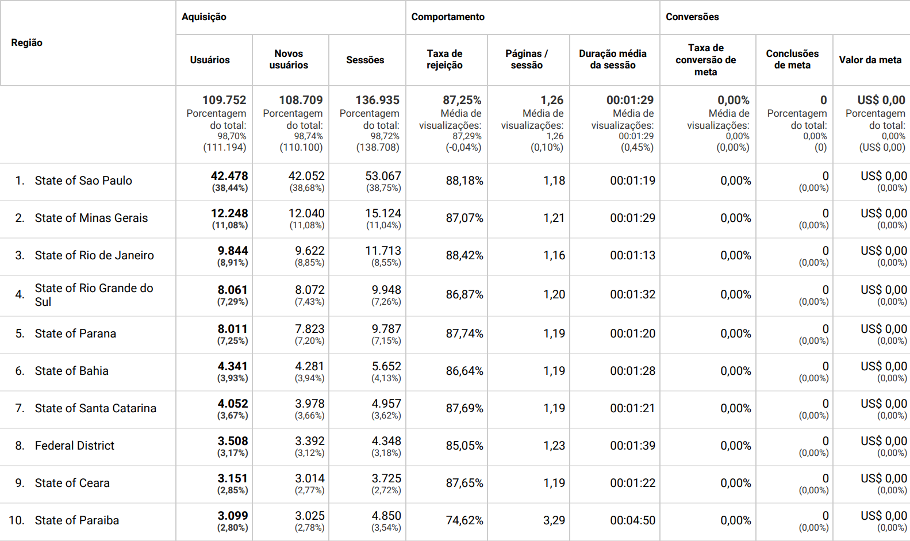
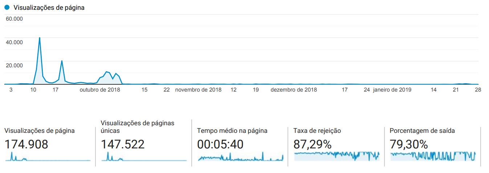
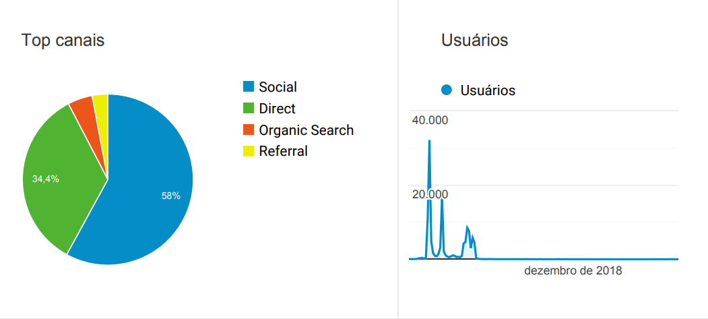
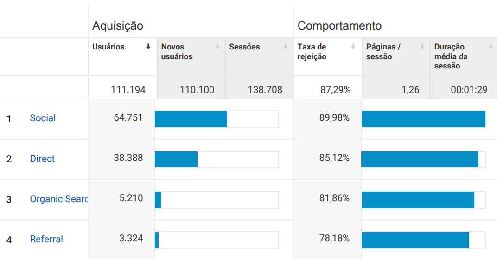

```{r echo=FALSE, message=FALSE, warning=FALSE}
library(tidyverse)
library(here)
library(viridis)
source(here::here("code/lib.R"))
theme_set(theme_report())

knitr::opts_chunk$set(tidy = FALSE,
                      fig.width = 6,
                      fig.height = 5,
                      warning = F,
                      echo = FALSE)

paleta = c("#404E4D",
           "#92DCE5",
           "#938BA1",
           "#2D3142",
           "#F4743B")

cbPalette <- c("#bcc0c6", "#56B4E9")

```

```{r read, warning=FALSE}

dados <- read_projectdata()
# eleitos <- read_csv(here::here("data/eleitos.csv"), col_types = cols(
#         eleito = col_logical()))
# dados <- read_csv(here::here("data/estado-dos-candidatos.csv"), 
#     col_types = cols(candidaturas = col_double(), 
#         eleito = col_logical(), recebeu = col_logical(), 
#         respondeu = col_logical(),date_modified = col_datetime(format = ""),
#                  date_created = col_datetime(format = "")))
# 
# dados <- dados[,-50]
# 
# eleitos <- eleitos %>% mutate(nome_urna = ifelse(nome_urna == "CHICO D&APOS;ANGELO", "CHICO D ANGELO", nome_urna))
# eleitos <- eleitos %>% select(nome_urna, uf, eleito)
# eleitos <- eleitos %>% mutate(nome_urna = toupper(nome_urna)) %>% mutate(uf = toupper(uf))
# dados <- dados %>% mutate(nome_urna = toupper(nome_urna)) %>% mutate(uf = toupper(uf))
# 
# dados <- dados %>% left_join(eleitos, by = c("nome_urna" = "nome_urna", "uf" = "uf")) 
# dados <- dados %>% mutate(eleito = ifelse(is.na(eleito), FALSE, eleito))
# 
# dados <- dados[,-c(61:63)]
# 
eleitos <- dados %>% filter(eleito == TRUE) 

```

*Atualizado em `r lubridate::now()`*

## Total de respostas de candidaturas

Durante cerca de dois meses os candidatos ao cargo de deputado federal foram contatados para responderem o questionário da Voz Ativa. Nos gráficos seguintes há um sumário do progresso de respostas coletadas através do SurveyMonkey. 

Cerca de 14% dos candidatos dos quais a plataforma conseguiu contactar respondeu o questionário. Com divulgações efetivas em plataformas e redes sociais a adesão dos candidatos à plataforma continuou crescente até o dia das eleições.

```{r}
dados %>% 
    summarise(
        `Total de candidaturas` = n(),
        `Conseguimos email` = sprintf("%d (%.1f%%)", sum(recebeu), 100* sum(recebeu) / n()),
        `Responderam` = sprintf("%d (%.1f%%)", sum(respondeu), 100*sum(respondeu) / sum(recebeu))
    ) %>% 
    gather(key = "Número", value = "Valor") %>% 
    knitr::kable()
```

Entre os eleitos, temos bem menos candidaturas que responderam.

```{r}
eleitos <- eleitos %>% mutate(reeleicao = ifelse(reeleicao == 1, TRUE, FALSE))
eleitos %>% 
    summarise(
        `Total de eleitos` = n(),
        `Temos email` = sprintf("%d (%.1f%%)", sum(recebeu), 100* sum(recebeu) / 513),
        `Responderam` = sprintf("%d (%.1f%%)", sum(respondeu), 100*sum(respondeu) / 513),
        `Tem informações na câmara` =  sprintf("%d (%.1f%%)", sum(reeleicao), 100*sum(reeleicao) / 513)
    ) %>% 
    gather(key = "Número", value = "Valor") %>% 
    knitr::kable()

```


```{r}
dados %>% 
    filter(!is.na(date_created)) %>% 
    select(date_created) %>% 
    arrange(date_created) %>% 
    mutate(i = 1, 
           Total = cumsum(i)) %>% 
    ggplot(aes(x = date_created, y = Total)) + 
    geom_line(color = "#56B4E9", size = 1.2) + 
    labs(title = "Número de respostas ao longo do tempo", 
         x = "Data", 
         y = "Respostas recebidas") 
```


### Por estado

Analisando nosso progresso num contexto de estado vemos a questão de respostas percentuais e absolutas para candidatos em geral e candidatos eleitos. Na visão geral, São Paulo foi o estado onde obtivemos maior sucesso percentual e em nenhum estado não obtivemos respostas. O Espírito Santo, décimo segundo com o maior percentual de respostas, foi o estado com maior proporção de candidatos eleitos e que responderam a plataforma Voz Ativa.

```{r}
dados %>% 
    count(uf, respondeu) %>% 
    mutate(Respondeu = if_else(respondeu, "Sim", "Não")) %>% 
    group_by(uf) %>% 
    mutate(`Respondeu (%)` = n / sum(n) * 100, 
           sucesso = min(`Respondeu (%)`)) %>% 
    ggplot(aes(x = reorder(uf, sucesso), y = `Respondeu (%)`, fill = Respondeu)) + 
    geom_col(position = "stack") + 
    coord_flip() + 
    labs(
        x = "",
        title = "Percentual de respostas por estado"
    ) + scale_fill_manual(values = cbPalette)

```


```{r}
eleitos %>% 
    count(uf, respondeu) %>% 
    mutate(Respondeu = if_else(respondeu, "Sim", "Não")) %>% 
    group_by(uf) %>% 
    mutate(`Respondeu (%)` = n / sum(n) * 100, 
           sucesso = ifelse(respondeu == TRUE, min(`Respondeu (%)`), 0)) %>% 
    ggplot(aes(x = reorder(uf, sucesso), y = `Respondeu (%)`, fill = Respondeu)) + 
    geom_col(position = "stack") + 
    coord_flip() + 
    labs(
        x = "",
        title = "Percentual de respostas de eleitos por estado"
    ) + scale_fill_manual(values = cbPalette)

```

Já em valores absolutos São Paulo lidera tanto em uma visão geral como entre os candidatos que foram eleitos, no entanto Rio Grande do Sul e Paraná ultrapassam o Rio de Janeiro quando se trata de quantidade de respostas entre candidatos eleitos. Podemos observar também que dentre os 26 estados brasileiros em 17 não obtivemos respostas dos candidatos que foram eleitos.

```{r}
options(scipen = 999)
dados %>% 
    count(uf, respondeu) %>% 
    mutate(Respondeu = if_else(respondeu, "Sim", "Não")) %>%
    mutate(countsim = ifelse(respondeu, n, 0)) %>% 
    ggplot(aes(x = reorder(uf, countsim), y = n, fill = Respondeu)) + 
    geom_col(position = "stack") + 
    coord_flip() + 
    labs(
        x = "",
        title = "Respostas em absoluto por estado",
        y = "Quantidade de candidaturas") + scale_fill_manual(values = cbPalette)


```


```{r}
eleitos %>%  
    count(uf, respondeu) %>% group_by(uf) %>% mutate(total = sum(n)) %>% ungroup() %>% 
    mutate(Respondeu = if_else(respondeu, "Sim", "Não")) %>% 
    mutate(countsim = ifelse(respondeu, n, 0)) %>% 
    ggplot(aes(x = reorder(uf, countsim), y = n, fill = Respondeu)) + 
    geom_col(position = "stack") + 
    coord_flip() + 
    labs(
        x = "",
        title = "Respostas de eleitos em absoluto por estado",
        y = "Quantidade de candidaturas"
    ) + scale_fill_manual(values = cbPalette)

```


### Por partido

Sob a perspectiva de partido político, é visto que os partidos considerados menores, em geral, aderiram mais à Voz Ativa do que os tradicionalmente dominantes da câmara como o PSDB, MDB e PT, sendo esse uma exceção, pois teve uma porcentagem expressiva de respostas ao compará-lo aos outros.

```{r}
dados %>% 
    count(sg_partido, respondeu) %>% 
    mutate(Respondeu = if_else(respondeu, "Sim", "Não")) %>% 
    group_by(sg_partido) %>% 
    mutate(`Respondeu (%)` = n / sum(n) * 100, 
           sucesso = min(`Respondeu (%)`)) %>% 
    ggplot(aes(x = reorder(sg_partido, sucesso), 
               y = `Respondeu (%)`, 
               fill = Respondeu)) + 
    geom_col(position = "stack") + 
    coord_flip() + 
    labs(
        x = "",
        title = "Percentual de respostas por partido"
    ) + scale_fill_manual(values = cbPalette)

```


```{r}
eleitos %>% 
    count(sg_partido, respondeu) %>% 
    mutate(Respondeu = if_else(respondeu, "Sim", "Não")) %>% 
    group_by(sg_partido) %>% 
    mutate(`Respondeu (%)` = n / sum(n) * 100, 
           sucesso =ifelse(respondeu == TRUE, min(`Respondeu (%)`), 0)) %>% 
    ggplot(aes(x = reorder(sg_partido, sucesso), 
               y = `Respondeu (%)`, 
               fill = Respondeu)) + 
    geom_col(position = "stack") + 
    coord_flip() + 
    labs(
        x = "",
        title = "Percentual de respostas de eleitos por partido"
    ) + scale_fill_manual(values = cbPalette)

```


```{r}
dados %>% 
    count(sg_partido, respondeu) %>% 
    mutate(Respondeu = if_else(respondeu, "Sim", "Não")) %>% 
    mutate(countsim = ifelse(respondeu, n, 0)) %>% 
    ggplot(aes(x = reorder(sg_partido, countsim), y = n, fill = Respondeu)) + 
    geom_col(position = "stack") + 
    coord_flip() + 
    labs(
        x = "",
        title = "Respostas em absoluto por partido",
        y = "Quantidade de candidaturas"

    ) + scale_fill_manual(values = cbPalette)


```

```{r}
 eleitos %>% 
    count(sg_partido, respondeu) %>%  
    mutate(countsim = ifelse(respondeu, n, 0)) %>% 
    group_by(sg_partido) %>% mutate(total = sum(n)) %>% ungroup() %>% 
    mutate(Respondeu = if_else(respondeu, "Sim", "Não")) %>% 
    ggplot(aes(x = reorder(sg_partido, countsim), y = n, fill = Respondeu)) + 
    geom_col(position = "stack") + 
    coord_flip() + 
    labs(
        x = "",
        title = "Respostas de eleitos em absoluto por partido",
        y = "Quantidade de candidaturas"
    ) + scale_fill_manual(values = cbPalette)
```


### Relação partidos e estados na Voz Ativa

A participação dos partidos nas eleições e como utilizaram a Voz Ativa em cada estado é observável abaixo. Em suma, os partidos com mais candidatos em um estado tem uma porcentagem baixa de adesão à plataforma. Há uma reafirmação da análise acima que indicou o NOVO, a REDE e o PSOL como os partidos mais presentes na Voz Ativa. 

```{r fig.width=8}
dados %>% 
    filter(recebeu) %>%
    count(sg_partido, uf, respondeu) %>% 
    # complete(sg_partido, uf, respondeu, fill = list(n = 0)) %>% 
    group_by(sg_partido, uf) %>% 
    mutate(prop = n / sum(n), total_no_estado = sum(n)) %>%
    filter(respondeu) %>% 
    ggplot(aes(x = reorder(sg_partido, prop), y =reorder(uf, prop, median), color = prop*100, size = total_no_estado)) + 
    geom_point(alpha = .8) + 
    scale_color_viridis(option = "B", direction = -1) + 
    coord_flip() + 
    labs(x = "", y = "", color = "% responderam", size = "Candidatos")
```

# Analisando os dados gerados pelo Google Analytics

Com o auxílio do Google Analytics coletamos as informações de tráfego e acessos ao site [www.vozativa.org](www.vozativa.org). 
Considerando o período entre o dia 01 de setembro de 2018 até o dia 28 de janeiro de 2019.
Com um tempo médio na página de quase 1 minuto e meio, a plataforma teve 111.194 usuários e quase 175 mil visualizações. O estado de São Paulo foi a origem da maior parte (38,44%) dos acessos à plataforma, seguido de Minas Gerais (11,08%) e do Rio de Janeiro (8,91%).

### Quantidade de usuários por região




### Quantidade de visualizações da página 



### Quantidade de usuários (visão geral)


### Tempo de permanência na página


### Canais de acesso

Os gráficos abaixo informam por quais canais de acesso o vozativa.org foi visitado, podemos observar que redes sociais como o facebook foram o maior canal de acesso utilizado.



<!-- ### Por partido e UF -->

```{r fig.height=9, fig.width=9}

# dados %>% 
#     count(sg_partido, uf, respondeu) %>% 
#     mutate(Respondeu = if_else(respondeu, "Sim", "Não")) %>% 
#     group_by(sg_partido) %>% 
#     mutate(
#         respondeu_partido = n / sum(n),
#         sucesso = min(respondeu_partido)) %>% 
#     group_by(sg_partido, uf) %>% 
#     mutate(`Respondeu (%)` = n / sum(n) * 100) %>% 
#     ggplot(aes(x = reorder(sg_partido, sucesso), 
#                y = `Respondeu (%)`, 
#                fill = Respondeu)) + 
#     geom_col(position = "stack") + 
#     coord_flip() + 
#     facet_grid(. ~uf) + 
#     labs(
#         x = "",
#         title = "Respostas por PARTIDO (em %)"
#     )
```

